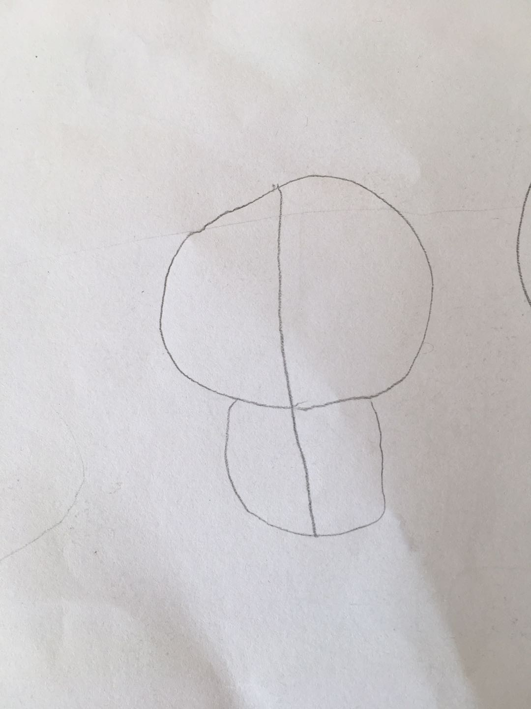

## 0906

今天和老婆商量买餐桌、书架、床等。

她要买一整套的，颜色一样，协调比较好看。

我想不需要一样，各自好看就行，

> 参差多态，乃幸福本源。

最后，听她的。

---

今天一起做作业：“我来说，你来说”，游戏规则，我说，她不能说话，我也不能看看她的话。

我告诉她怎么画这张图片：

她画成这样

1. “画两个圆上下在一起，上面那个圆是下面那个圆的2/3大”，她理解成上面那个圆比下面那个圆大。
2. “画一条线，连接上面那个圆的圆心到下面那个圆的边上”, 她理解成现在画的这样。

我最大的感受是：我在用孩子没办法理解的语言跟她沟通。以后日常生活中多注意。

## 0905

带女儿去少年宫，她玩了一会跟我说：”好无聊“，我听到这三个字很容易生气，没好气的怼她：“无聊是你自己的事情，自己想办法解决。”

她有点要流泪地说：“我都没生气，你就生气了。”

下午本来打算带她和小朋友捞小鱼的，在小区买了一个捕鱼网，在路上很容易就弄坏了。去捞鱼的路上，有个老爷子在卖小玩意。另外一个小朋友要买喷水管，她爸爸不给她买，她就生气发火了。

女儿看见，想买个捞鱼网，我嫌质量不好，就没买，她也同意了。一个下午玩得不是很开心，晚上回到家后情绪爆发了，说我都不给她买捞鱼网。

咳，就10块钱，也比让孩子伤心大半天呢。女儿已经很棒了！

## 8月份

有一次跟女儿吵架，她哭个不停，我很烦，就跟她说：“别哭了，再哭拍死你。”

她继续哭：”你拍死我，你们就没有我了。“