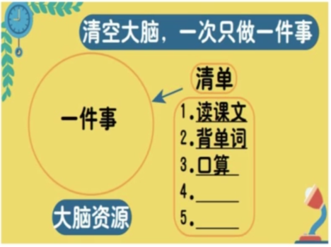
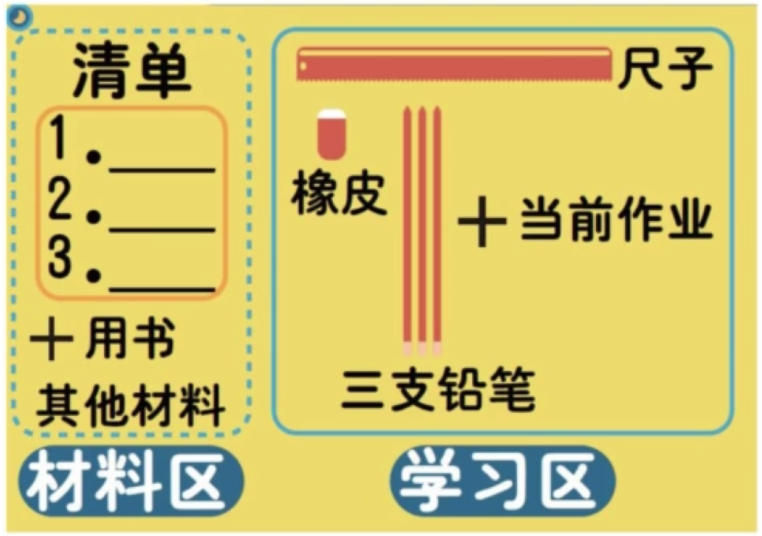

# 如何培养孩子的学习能力
1. 学习动力
2. 学习方法
3. 学习毅力

## 1. 如何培养孩子的学习动力

### 常见问题一: 没动力

开始对小学学习有好奇心，之后就会觉得作业是种负担，要么不想做，要么很磨蹭，花大量时间在并不困难的作业上。

#### 原因分析

不喜欢慢反馈。学习是慢反馈，而孩子本性上喜欢快反馈。

神经抑制能力弱。大脑额叶发展未完善，导致行为抑制能力不足。

#### 建议1:利用天然兴趣，激发学习动力
条件反射:学习  <=(建立联结)=> 有趣，好心情

共享孩子觉得好玩的时刻:“偷偷地”智慧地跟随

父母不可以走在孩子前面，告诉孩子学习“好玩儿”；而是要创造机会后，耐心地待待一个时刻，等孩子发现“好玩儿”后，欣喜地共享这个感受。

#### 建议2:看到行为的好处，强化内在学习动力
强化:行为 ==>好处，行为增加 (鸽子啄按钮的试验）
聚焦具体行为的评价，让孩子看到行为的好处。

### 常见问题二:没信心
每天回家，爸爸妈妈的问候也渐淅从“今天乖不乖”变成了“测验得了多少分”，弄得孩子一提考试就烦，对考试没信心。

如何帮助刚刚跨入小学的孩子树立正确的分数观?孩子的进步，分数能否说明问题?

#### 原因分析

没有形成正确的成绩观。
太高的目标反复无法达成会让孩子无助。

#### 建议1:关注过程而不是结果，在因上努力オ能在果上收获。

过程性目标结果性目标

树立正确的学习观:100分重要，但如何得到100分更重要。

珍惜错题，看到错的价值并从中获得成长

#### 建议2:看到孩子的“困难”，及时找到适合的方法突破
塞里格曼“习得性无助”： 狗的点击试验 
给孩子“最近发展区”内的方法，要适合孩子，用了有效果

## 2. 如何培养孩子的学习毅力
### 常见问题一:坐不住
孩子坐在那学习ー会要喝水，一会要上厕所，拿个橡皮都能抠半天;

玩的时候聚精会神，可在坐下来学习就像心里长了草一样，一会儿都没法坚持。

#### 原因分析

错把“好好学”“高效”“专注”“努力”“认真”这些品质，这些小学阶段的能力培养目标简单粗暴地当做要求提给孩子，当孩子做不到时家长和孩子都会陷入无助。

#### 建议1:用正面言语，表达正面期许

自控不是“不做什么”，而是“可以如何做”

#### 建议2:少说多看，看明白孩子具体在哪黁蹭，找准方法

别说“别磨蹭”，也别说“快点儿写
要看明白具体“哪儿磨蹭”，才能给到切实可行的方法。

### 常见问题二:坚持不下来

孩子下定决心要好好学习，想成为班里成绩最好的那个，想下次考试提升名次，但总是“三分钟热情”，等到真学习时坚持不下来，没有几天就松懈了。

#### 原因分析
孩子正在学习“如何确立目标”的过程中，出现达不成目标的情况是必然的。他要学习两个能力

一是把目标设定得合适;

二是目标执行过程中出现问题能够及时调整。

#### 建议1:设定目标时，设置一周的观察调整期

太高、多次尝试都达不成的目标会让孩子无助，退缩
设置一周的观察调整期

1. 总结好用的方法
2. 奖励机制
3. 确定能实现的目标

#### 建议2:观察孩子的情绪，看到想学又不想学的矛盾
看到复杂的情绪（花瓶还是人脸）
强化孩子想学的力量

## 03如何让孩子掌握学习方法?

### 常见问题一:作业效率慢

明明二十分钟能做完的作业，做两个小时都做不完，每天拖到很晚才能睡觉，睡眠时间保证不了，影响第二天的学习，形成恶性循环。

#### 原因分析

“好习惯”是个抽象的词，实际上它包括着很多具体的行为习惯，要一天天、一点点地养成。

#### 建议1：清单法

清空大脑，一次只做一件事

不要盲目要求“好好学”，要看到孩子的“难”，帮他做到。
建立外在清单，清空大脑，让所有的大脑资源用于加工当前作业。

#### 建议2：桌面整理法

只留“必须要的”物品，最大可能地减少分神因素，减少压力。
其他“突然想起的事”，简单地用几个字记在清单上，不当场讨论，但也不留压力。

### 常见问题二:不主动思考
上课不积极主动，不举手回答问题，老师讲什么就听什么。别的同学回答问题时觉得跟自己无关，不能认真思考。
#### 原因分析:
未形成思考和交流和习惯，需要主动地培养。

### 建议
1.提开放性问题，鼓励孩子思考。
2.强化孩子的互动行为，鼓励孩子主动提问。
3.学习倾听，在别的同学的回答中获得信息。

学习力的培养是一场长跑，是一生的旅程

## 结尾：鲁米的诗

> 在好与坏之间
>
> 有一片田野
>
> 我将在那遇见你
>
> ​                                --鲁米